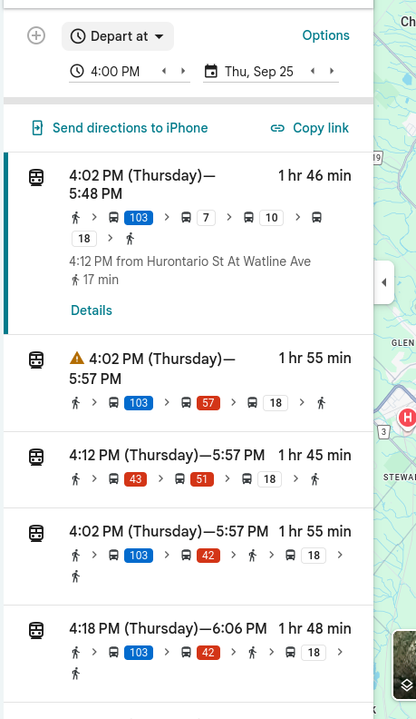

+++
title ='Highway 410 is a Disaster and I Dont See a Light at the End of the Tunnel'
date = 2025-09-24T19:47:47-04:00
draft = false
summary = "Here I rant about my work commute as it drains my life"
description = " "
toc = false
readTime = true
autonumber = true
math = true
tags = ["rant", "transit"]
showTags = false
hideBackToTop = false
+++

### The Dreaded Commute

Three times a week I am required to drive to my office, which is in Missisauga, from my home in Brampton. In the morning this means I take highway 410 in the southbound direction, then merge into the 403 and make an exit somewhere near my office. This is usually not an issue since I leave pretty early in the morning to miss out on the morning rush. This is a 25 minute drive on a regular day.

But the commute back home in the other direction is another story, and is a source of frustration for me and what I imagine is thousands of my compatriots just trying to get home after a long day of work. I do not say this as an exaggeration: this highway effectively reduces my quality of life more than any other piece of infrastructure in this province. 

I usually leave work around 4 pm and get back on the 403 with manageable traffic in the way. If the commute was anything like the morning, I would get home by 4:30 pm. However, as soon as I hit highway 410 northbound, it all goes downhill.

### Whats the Problem?

You see, the highway has a bottleneck problem. At its biggest, the highway is something like 6 lanes going northbound, including one HOV lane. However, by the time it gets to where I exit (sandalwood), it has reduced down to two lanes in the north direction. Now this would not be a problem if most commuters got off at an earlier point in the highway, but given the recent explosive growth in north Brampton as well as Caledon, that anecdotally does not seem to be the case. 

To make things even worse, the reduction from 6 lanes down to 2 lanes happens over a few exits at a small distance. This causes a jumble of confused drivers trying to merge away from closing lanes, while other frustrated commuters dont give them space to merge, causing backup after backup.

Now you might say: "Harseerat, theres an HOV lane! Why dont you get an HOV pass if this bothers you so much?" And I say: great question stranger! Its because:

- The HOV lane is equally as backed up as every other lane
- No one follows the HOV rules anyways and they dont get enforced! Most people I see in the HOV lane are solo drivers and there is no way all of them have a pass
- Life as a commuter is hard and I try to find what little joy I can in changing lanes back and forth and imagining I am making progress. Sorta like sisyphus if he was a brown guy from Brampton

### Why Not Take Transit?

As someone who works on designing transit stations, I would love to not have to take my car and just take a bus or a train to work. But as you can see below given the state of things in Canada and the lack of transit options, its about a 2 hour journey home and requires transferring 4 different bus routes. 

### Highway 413 is Going to Solve Everything

No its not. Maybe it will temporary divert some traffic when it gets built in the next decade or so, however as anyone familiar with [induced demand](https://en.wikipedia.org/wiki/Induced_demand) will tell you, its a matter of time before things get back to how they were. 

The real solution to this issue is not just adding more lanes, its creating a transit system that is useable and more convenient than taking the road for more people. The more people we get off the road and into transit, the better it is for everyone. But I dont know when we will get there, if ever. 