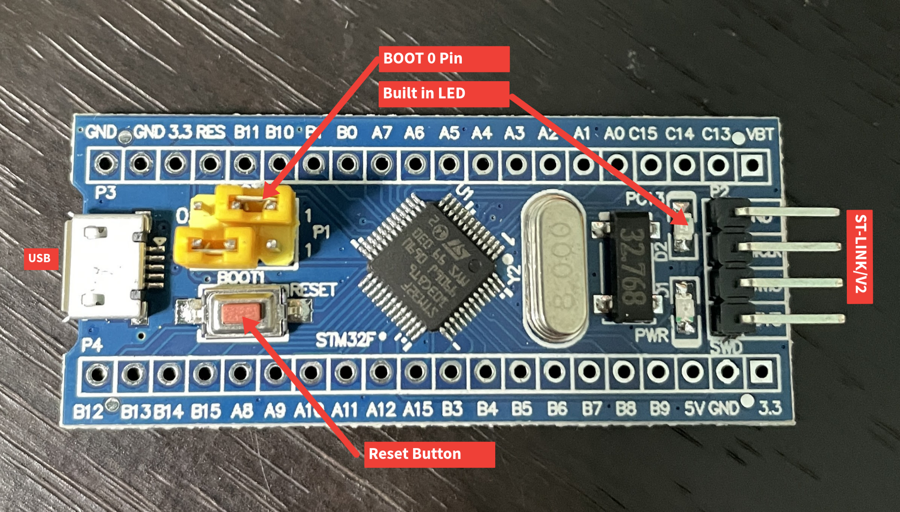

+++
title = 'How to use Platform.io to program and debug STM32F103C8T6 Blue Pill Development board over USB'
date = 2024-09-01T13:30:39-04:00
draft = false
summary = "Here I explain how I got the stm32 clone I got off of aliexpress working with PlatformIO"
description = " "
toc = false
readTime = true
autonumber = true
math = true
tags = ["", ""]
showTags = false
hideBackToTop = false
+++

The STM32F103C8T6 Blue Pill development board is a powerful alternative to a standard Arduino board such as the Arduino Uno. It is equipped with a powerful 32-bit Arm processesor that is leagues ahead of the ATmega 8-bit processors in an Arduino Uno. This is one of the main reasons I decided to use a Blue Pill board for my drone flight controller project. However, I quickly realized the relative difficulty of setting up a development environment for this board to allow for easy upload of code and debugging.

So I have written this article to summarize what I've learned and help anyone else going through the same process. In this article I will go through how to set up a development environment for the Blue Pill in platform.io. Here's what we will need:
1. An STM32F103C8T6 Blue Pill development board
2. A mini USB cable
3. An ST-LINK/V2 debugger and programmer
4. 4 x jumper cables

Firstly, we need to flash the HID bootloader on the board to enable us to upload code through USB as well as debugging through the serial monitor. For this, we will need the STM32 Cube Programmer, which can be downloaded from here. In addition, we also need the bootloader binaries, which can be downloaded from the github repository found here. Download the folder labeled as "stm32_binaries.zip" and unzip this folder.

Once the STM32 cube programmer is installed, connect the Blue Pill to your computer via the ST-LINK/V2. Use jumper cables to connect the SWDIO, SWDCK, 3v and ground pins on the ST-LINK/V2 to the Blue Pill. Within the cube programmer, navigate to the HID bootloader binary that applies to your specific board. For my board the binary file was located in /stm32_binaries/F103/low_and_medium_density/hid_generic_pc13.bin. Before flashing the bootloader, ensure that the BOOT0 jumper on the board is set to "1" as shown in the image below. Once this is done, flash this binary on the Blue Pill and move the BOOT0 jumper back to the "0" position, then press the reset button. The built in LED on the board (marked below) should start rapidly blinking if this is successfull. You can now unplug the ST-LINK/V2 from the board.



This bootloader enables you to upload code and debug through the serial monitor on the Blue Pill, eliminating the need to use an ST-LINK/V2. However, there are some special settings in Platform.io we need to use for this to work. Below is what my platform.ini configuration file looks like using the arduino framework on the Blue Pill. Ensure that you use the same build flags in your configuration, otherwise the bootloader will be wiped after uploading code and you will have to re-flash it on the board. Additionally, you might need to change the upload_port option depending on your setup.

```
[env:bluepill_f103c8]
platform = ststm32
board = bluepill_f103c8
upload_protocol = hid
upload_port = /dev/ttyACM0
framework = arduino
monitor_speed = 57600
board_build.core = stm32duino
build_flags = 
	-D PIO_FRAMEWORK_ARDUINO_ENABLE_CDC
	-D USBCON
	-D USBD_VID=0x0483
	-D USBD_PID=0x5740
	-D USB_MANUFACTURER="Unkown"
	-D USB_PRODUCT="\"BLUEPILL_F103C8\""
	-D HAL_PCD_MODULE_ENABLED
monitor_dtr = 1
```
If you get the following error: **hid-flash not found** while trying to upload the program to the board, you can easily solve this by getting the appropriate hid-flash binary from the bootloader [here](https://github.com/Serasidis/STM32_HID_Bootloader/releases). and placing it in the `~/.platformio/packages/tool-stm32duino` directory.

You might also face issues with uploading the program to the `/dev/ttyACM0` port due to permissions issues. In this case, simply add your user to the "dialout" group by running the command `sudo adduser $USER dialout` and rebooting.

Finally, you also need to add permissions to `/etc/udev/rules.d/99-stm32_hid_b1.rules` below. If the file does not exist, create it.
```
# STM32_HID_bootloader
ATTRS{idProduct}=="beba", ATTRS{idVendor}=="1209", MODE:="666"
```
After doing this reboot the computer or run `udevadm control --reload-rules` and uplug and plug the device back in and everything should be working. 
