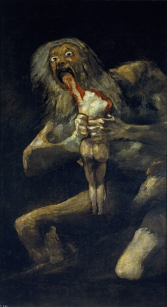

+++
title = 'The Odyssey Review'
date = 2026-08-03T11:16:01-04:00
draft = false
summary = "A review of the movie The Odyssey by Chriostopher Nolan"
description = " "
toc = false
readTime = true
autonumber = true
math = false 
tags = ["movie", "review"]
showTags = false
hideBackToTop = false
+++

I had the privelage to watch the Odyssey in IMAX this weekend on the first of August in a packed theatre. This movie has been a cultural phenomenon and as such every seat in this theatre was occupied to the point that even the bottom rows of the theatre, where you are basically 5 feet from the screen, was completely full.

Overall, I enjoyed this movie quite a lot, although there were some flaws that held it back for me. I read the Rober Fagles translation of the Odyssey pretty recently which made the experience of watching the movie that much more interesting; so I was glad I read it. For some people, comparing the original work to the adaptation sometimes takes away from the experience, because they have a deep relationship built up with the original text. For me, this was not the case mostly because I read the original text about two weeks before I watched the movie. However, I couldn't help but draw comparisons between the two, and it made me that much more engaged with both the poem and the movie. 

Before I proceed further, I want to note that this is a full-spoiler review. If you have not seen the movie, please do not read this.

# Spoiler Review

There were some things I thought were done really well in this movie. I thought the lead performance by Matt Damon was superb. You really need someone charismatic and someone with an established hollywood record to play Odysseus. Similar to Odysseus himself, Matt damon is a veteran of many a campaign (movies), which has built up a personal myth around him. He makes it very easy to buy into the character. I also thought Robert Pattinson did a spectacular job as Antinous, who functions as the main villain in the movie, signifying what is wrong with the suitors and condensing all of the greed, arrogance and cowardice into one character. I also really enjoyed Anne Hathaway's performance as Penelope, she does a great job playing a conflicted queen forced to make some tough choices and losing personal autonomy.

I am a big horror fan so I tend to really love horror-like elements in other genres. Directors who are not typically horror directors tend to bring their own flare when they attempt horror, which is always interesting to see. There are two set pieces in the Odysseythat made me think Chistopher Nolan would make a great horror director. The first sequence is when Odysseus and his crew encounter Polyphemus the cyclops. The depiction of the cyclops is inspired by the painting *Saturn Devouring His Son* by Francisco Goya, which does a great job capturing the grotesque nature of the beast. The movements of the cyclops, the unnverving single eye, the texture of his skin, his cries when he loses his eye and prays to his father; all combine to make a thrilling yet horriying sequence of events. You cannot help but wonder why Odysseus makes the choces he does, which is also reminiscnent of horror charactersdo. This sequence makes you think that perhaps its Odysseus's own hubris and arrogance in aggravating the gods that has lead him to his predicament. 

The second setpiece is their encounter with the witch Circe. The sequence begins with Odysseus's crew barging into the home of a stranger, bypassing all warning signs in the form of exotic animals lounging about, to come and steal food from a homestead. At one point Circe even says explicitly to Odysseus that his crew meant her harm. So is it really wrong for Circe to turn the men into pigs? Her thesis is that pigs is the true nature of these men. When she is compelled to turn them back into human she says to them: *"Back to your disguises"*, which I found to be a great addition. The horror element of this scene is done wonderfully, the men are locked in a spell devouring miscellaneous slop from their bowls while Circe goes around and moulds their bodies into those of swine; at one point she shoves her whole hand forearm deep into a mans throat. Meanwhile there are cuts to Odysseus hunting a deer on the island, slowly coming to the realization that the animals on this island are actually men who have been turned into animals. Its a really suspensful scene that keeps you on the edge of your toes. 

On the other hand, Telemachus's journey to find news about his father was the worst part of the movie, and also the poem for me. All in all, he is quite useless and without agency in this movie, basically running around like a headless chicken. In the poem he is guided by Athena to go and find news about his father, and this journey is supposed to represent him coming to age in a way. The idea is that is comes back from talking to these great kings with some political clout against the suitors and the council of Ithica. But to be honest, I did not buy into that in the poem and in the movie. It seems to me that Telemachus has no agency of his own, he is lead forward by events, and in the poem he is pushed by Athena insofar as he says what she tells him to say word by word. 

This does bring me to an interesting difference between the movie and the poem. In the poem, Athena plays a huge role in every event that takes place. She comes to Telemachus in the form of Pallas Athena to compell him to journey to find news of his father. She petitions to Zeus to let Odysseus be free from Calypso. In the poem, Zeus sends Hermes to Calypso with a message telling her to let him go. In the movie, Calypso hears thunderclouds in the distance a few times, which lets her know what Zeus's wish is. In fact, the gods are very subtle in the movie compared to the poem. Multiple times in the poem you can hear thunder in the background, signalling Zeus is affecting events. Even when dealing with Circe, Odysseus is given a drug that makes him immune to her magic by Hermes. In the movie, they just have a nice chat where Odysseus threatens her sister. In the peom, Telemachus evaded an ambush by the suitors on his way to Ithica because he is warned by Athena. However in the movie, Telemachus is saved by Odysseus who has been warned by his servant, the swineherder, of the trap. Now these differences do not take away from the movie at all for me, I don't think I would have enjoyed a movie where the gods come down to earth and basically hold Odysseus's hand throughout his journey. But it might affect the enjoyment of people who have a deeper relationship with the original text.

The ending sequence as soon as Odysseus lands on Ithica is perfectly executed. All of the built-up tension is released as soon as you hear the twang of Odysseus's bow. The action sequence after this are also tense and thrilling, even though Telemachus is busy being useless as always. Whereas in the poem Odysseus slaughters every single suitor, has his slave-servents clean up the blood and guts from the floor of his house, and then has all of the servents that were disloyal to him (read: were forced to sleep with the suitors) hanged; in the movie Odysseus spares the suitors who take a knee and we don't see a general massacre of servants. There are a lot of modern sensibilities that bleed into this adaptation which might rankle some folks, but most of them are a general improvement for me.

There are some modern additions that do kind of take me out of the movie though. Here is a list of some of them:

- Telemachus calling Odysseus "Dad". This extends to the use of modern language in general. There is just something about old-timey sounding language that works for me more than modern language in a period piece. 
- Odysseus being way too aware of his place in history with the line *"Our age of bronze is collapsing"*. Does he have access to history textbooks from 2026?
- Helen of Troy whispering into Telemachus's ear that she is sorry for Penelope. That just felt so blunt. Nolan nobly tries to insert some agency and depth to the women in the text, but the way he does it does not work for me entirely. 
- Penelope saying to Telemachus that she as been sitting on the throne for 20 years and she is just as capable to rule (I am paraphrasing). Again, just really blunt.
- Calypso entirely as a character. She looked like she walked off the set of a perfume commercial to film this movie.

Despite these flaws, at its best the Odyssey is a visual spectacle. All of the scenes on the ocean are visceral and immersive, you are really transported to a different time and place in the theatre. The sound design is amazing, you feel every beat in your bones in the theatre. The cyclops scene stands out to me in terms of the sound design, while the special effects of the crew being molded into pigs is another spectacular scene. It all coallesces down to a great night out at the theatre, which Nolan has been delivering for his entire career, and I hope continues to deliver for many decades to come. 

Overall, I would give this movie an 8 out of 10. Some clunky dialogue, characterizations and decisions on how to adapt the story keep it from perfection, but nevertheless this is a movie worth seeing in theatres.