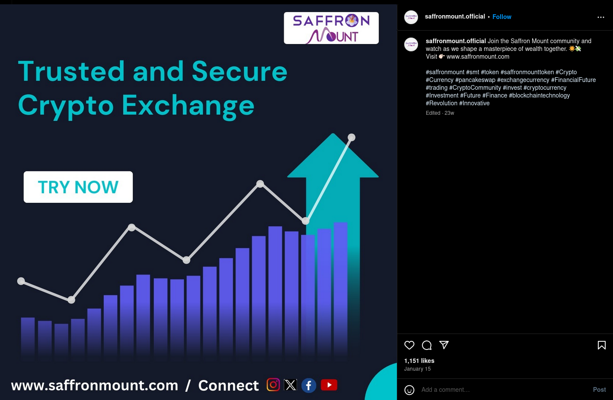

+++
title = 'Saffron Meta Token (SMT) and Other Crypto Schemes'
date = 2024-06-25T20:42:19-04:00
draft = false
summary = "Here I dive into what I found out after reading about the SMT token, which exhibits the same problem that seems to plague the cryptocurrency industry in general."
description = "Here I talk about the SMT token."
toc = false
readTime = true
autonumber = false
math = false
tags = ["crypto", "finance"]
showTags = false
hideBackToTop = false
+++
## Crypto
I remember when I first heard about Bitcoin, when in 2013 the FBI arrested [Ross Ulbririch](https://en.wikipedia.org/wiki/Silk_Road_marketplace) a.k.a *Dread Pirate Roberts* in a library, for running the darknet marketplace *Silk Road*. 

You see, buying drugs online with government backed currency like the US dollar is easily traceable by federal agencies and banks, especially due to the Bank Secrecy Act and AML/ATF regulations. The Silk Road solved that issue by allowing users to buy drugs using Bitcoin, a cryptocurrency. The fact that this currency allowed users to circumvent government sensorship and transact on these darknet markets provided a solid use-case.

This happened a solid 7 years before the huge crypto boom that occured in 2021. Between 2013 and 2021, the price of Bitcoin went from around \$1100 to about \$64,000 USD. Which means that anyone who spend their Bitcoin on drugs in 2013 likely cried themselves to sleep in 2021. But this also highlights a fundamental issue I have with cryptocurrency. The primary reason most people buy cryptocurrency is as an investment. The primary use-case for cryptocurrency is as a *currency*. A deflationary economy incentivises hoarding; why would you want to spend your money on something today if you could buy twice of that same thing tomorrow without lifting a finger?

As a result, crypto has essentially gone from a project to create  decentralized currency to an instrument of greed. Now when you pitch into a fledgling crypto project, chances are you are doing it in the hopes that it will pump to 10%, 30%, 500% of its original value (provided you got in early enough). So what you end up seeing are projects such as influence Wizard of Soho's [TARD coin](https://www.coinscan.com/tokens/eth/0x899124ce2f766ed32e9375045c24db512dd4265c) (haha, get it?) or such technological wonders as [MEME coin](https://coinmarketcap.com/currencies/meme/).

The way a lot of these schemes operate is as follows:
- The founders generate hype before the launch of the currency using discord, telegram, reddit and other forums.
- Early members join these closed forums and are given early access to the tokens
- Given enough hype, when the token gets released, the value of the token skyrockets and new money pours in from the hype generated on reddit etc.
- The founders and early buyers dump their tokens and exit. Some people are left holding the bag.
- Hype dies down and the project is forgotten

And throughout this whole experience, there is nothing of value generated, no use-case, no promises fullfilled; only that money has changed hands from some people to other people. 

## Saffron Meta Token
Now this brings me to a crypto token that I have been exploring recently named [Saffron Meta Token (SMT)](https://www.saffronmeta.com/#) on the Polygon chain. What I find interesting about this token is its complete lack of information on what it is, what its aims are, what problem it solves and any other fundamental information a rational investor might want before buying into an investment. 

What it does offer is some lofty promises. For example; see the instagram post below where SMT claims to be an exchange. 

Now for the life of me I cannot figure out what this thing actually does, but it was featured at the Crypto Expo 2023 in Dubai so it must be legit.

This token seems to be very specifically tagetted at indian expats living in Dubai, as is evident by the influencers they hire to promote their product. Its the sort of shady investment that specifically relies on obfuscation and confusion to lure in people looking for yield. 

I mean, why invest in a simple S&P 500 index fund to earn measly ~10% return when you can potentially pitch into a crypto moonshot and become a trillionaire (is a question you should really not ask yourself)?

Anyways, I tried finding where this token actually trades and found some very interesting transactions. This token has a total supply of 50,000,000 SMT with 1825 holders as of July 17, 2024, the highest of which holds 81% of the total supply (talk about decentralized!!). It has an impressive amount of market activity with 105,715 in total transfers and a market cap of an even more impressive zero dollars and zero cents. There are also some very interesting transactions on the chain as well. Take [this transaction](https://polygonscan.com/token/0xd9019c8c7a896e48da45487ae49827b9ea261391?a=0x4044a333c021a59b002c3802bc7642a4e5c69953) for example. Where someone 3093 SMT in one transaction and takes out 3093 SMT in a subsequent two transactions. I wonder how many of the total trasctions are just a variation of this?

I started off this little journey to try and make sense of this token I've heard about from a family friend but I am ending this in profound confusion. As Warren Buffet advises investors, invest in business you understand and as I am now saying: stay away from obscure cryptocurrency projects.

